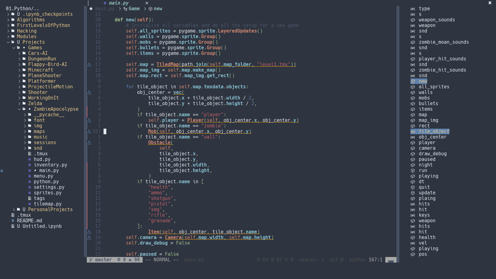
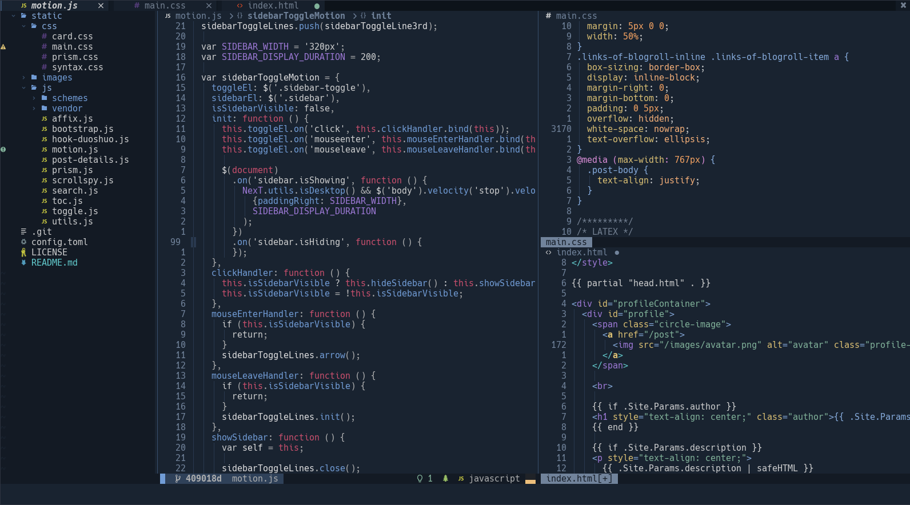
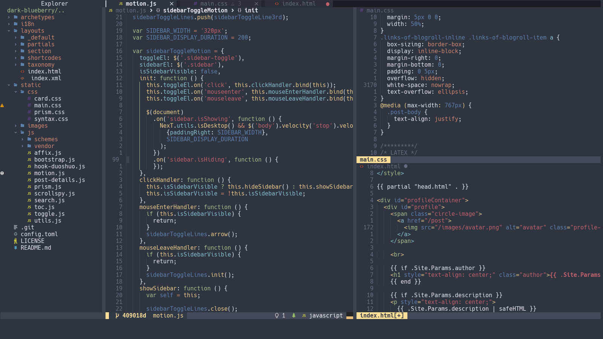

<p align="center">💀 A Hackable, Fully Featured, Rice Friendly NeoVim Configuration 💀</p>

<p align="center">
  <a href="#gallery">Gallery</a> •
  <a href="#features">Features</a> •
  <a href="#installation">Installation</a> •
  <a href="#usage">Usage</a> •
  <a href="#setting-up-pywal">Setting up PyWal</a> •
  <a href="#required-tools">Required Tools</a> •
  <a href="#todo">TODO</a>
  <br>
  <br>
  <a href="https://github.com/SingularisArt/Death.NeoVim/stargazers">
    </a>
  <a href="https://github.com/SingularisArt/Death.NeoVim/issues">
    </a>
  <a href="https://github.com/SingularisArt/Death.NeoVim">
    </a>
  <a href="https://github.com/SingularisArt/Death.NeoVim">
    </a>
</p>

<p align="center">
  
</p>

<p align="center">
  
</p>

# Gallery

<p align="center">
  
  
  
  
  
</p>

# Features

* Install in just one line of code, view [here](#installation) for more info.
* Blazing fast.
* Written in 100% **LUA**.
* Has TreeSitter syntax highlighting.
* Intellisense, Completion, Linting, and Debugging.
* Easily able to install LSP, DAP, and TS servers by running:
  * `:LspInstall`
  * `:DIIstall`
  * `:TSInstall`.
* Already supports $20+$ programming languages out of the box with LSP,
  Debugging, TreeSitter, and special plugins for each filetype.
* Git integration with [vim-fugitive](https://github.com/tpope/vim-fugitive)
  and [vim-gitgutter](https://github.com/airblade/vim-gitgutter).
* Informative [statusline](https://github.com/nvim-lualine/lualine.nvim) and
  [bufferline](https://github.com/akinsho/bufferline.nvim).
* Code snippets powered by [UltiSnips](https://github.com/SirVer/ultisnips).
* Intelligent suggestions with
  [vim-tabnine](https://github.com/zxqfl/tabnine-vim) and
  [vim-copilot](https://github.com/github/copilot.vim).
* Simple file browsing with
  [NvimTree](https://github.com/kyazdani42/nvim-tree.lua).
* Dynamic homepage with [alpha-vim](https://github.com/goolord/alpha-nvim).
* Distraction free writing with
  [ZenMode](https://github.com/folke/zen-mode.nvim) and
  [Twilight](https://github.com/folke/twilight.nvim).
* Common sense keybindings.
* Uses [Which-Key](https://github.com/folke/which-key.nvim) so you never forget
  your keybindings.
* Already comes with dozens of plugins that are already configured for you,
  view [here](#builtin-plugins) for more info.
* Already comes with dozens of filetypes that are already configured for you,
  view [here](#builtin-filetypes) for more info.
* Already comes with dozens of snippets that are already configured for you,
  view [here](#builtin-snippets) for more info.
* Comes with a config file so you don't have to deal with any of the dirty
  work, view [here](#config-file) for more info.
* Has dozens of themes already setup for you, view [here](#builtin-themes) for
  more info.

# Installation

```sh
bash <(curl -s https://raw.githubusercontent.com/SingularisArt/Death.NeoVim/master/utils/installer/installer.sh)
```

## Install Language Support

You can find a list of supported languages
[here](https://github.com/kabouzeid/nvim-lspinstall/tree/main/lua/lspinstall/servers).

To install any of them run

* Enter `:LspInstall` followed by `<TAB>` to see your options for LSP
* Enter `:TSInstall` followed by `<TAB>` to see your options for syntax
  highlighting
* Enter `:DIInstall` followed by `<TAB>` to see your options for debugging

# Usage

## Keybindings

<details><summary><code>Basic Key-Bindings</code></summary>
<p>
  
| Function                                | Keybind           |
| --------------------------------------- | ---------------   |
| Leader Key                              | `SPACE`           |
| Create a new tab                        | `Ctrl+t`          |
| Remove the current tab                  | `Ctrl+w`          |
| Toggle QuickFix                         | `Right Arrow`     |
| Close QuickFix                          | `Left Arrow`      |
| Previous QuickFix item                  | `Up Arrow`        |
| Next QuickFix item                      | `Down Arrow`      |
| Format file                             | `Ctrl+s`          |
| Correct a misspelled word               | `Ctrl+l`          |
| Create a vertical split                 | `<Leader>+v`      |
| Create a horizontal split               | `<Leader>+h`      |
| Close all splits                        | `<Leader>+o`      |
| Highlight everything                    | `Ctrl+a`          |
| Move text up                            | `J` (VISUAL MODE) |
| Move text down                          | `K` (VISUAL MODE) |
| Move text up                            | `<Leader>j`       |
| Move text down                          | `<Leader>k`       |
| Open NvimTree                           | `<Leader>e`       |
| Toggle easymotion                       | `<Leader>y`       |
| Toggle SymbolsOutline                   | `<Leader>u`       |

</p>
</details>

<details><summary><code>Packer</code></summary>
<p>
  
| Function                                | Keybind         |
| --------------------------------------- | --------------- |
| Install plugins                         | `<Leader>pi`    |
| Update plugins                          | `<Leader>pu`    |
| Clean plugins                           | `<Leader>pc`    |
| Load plugins                            | `<Leader>pl`    |
| Sync plugins                            | `<Leader>ps`    |
| Bring profile                           | `<Leader>pp`    |

</p>
</details>

<details><summary><code>Buffers</code></summary>
<p>
  
| Function                                | Keybind         |
| --------------------------------------- | --------------- |
| Pick from the buffers                   | `<Leader>bp`    |
| Close all buffers to the left           | `<Leader>bcl`   |
| Close all buffers to the right          | `<Leader>bcr`   |
| Move buffer next                        | `<Leader>bmn`   |
| Move buffer previous                    | `<Leader>bmp`   |
| Sort buffers by directory               | `<Leader>bsd`   |
| Sort buffers by extension               | `<Leader>bse`   |
| Sort buffers by relative directory      | `<Leader>bsr`   |
| Sort buffers by tabs                    | `<Leader>bst`   |
| List all buffers with JABS              | \`              |

</p>
</details>

<details><summary><code>Git</code></summary>
<p>
  
| Function                                | Keybind         |
| --------------------------------------- | --------------- |
| Git status                              | `<Leader>gs`    |
| Git add                                 | `<Leader>ga`    |
| Git commit                              | `<Leader>gc`    |
| Git push                                | `<Leader>gp`    |
| Git pull                                | `<Leader>gP`    |
| Git log                                 | `<Leader>gl`    |
| Git diff                                | `<Leader>gd`    |
| Lazy Git                                | `<Leader>gL`    |
| Lazy Git Filter                         | `<Leader>gf`    |

</p>
</details>

<details><summary><code>Translate</code></summary>
<p>
  
| Function                                | Keybind         |
| --------------------------------------- | --------------- |
| Show the translation in the cmd line    | `<Leader>Rt`    |
| Show the translation in a pop-up        | `<Leader>Rw`    |
| Convert the word to the translated word | `<Leader>Rr`    |

</p>
</details>

<details><summary><code>LaTeX</code></summary>
<p>
  
| Function                                | Keybind         |
| --------------------------------------- | --------------- |
| Clean                                   | `<Leader>lll`   |
| Clean Cache                             | `<Leader>llc`   |
| Compile                                 | `<Leader>lcc`   |
| Compile and show output                 | `<Leader>lco`   |
| Compile and show SS                     | `<Leader>lcs`   |
| Compile selected                        | `<Leader>lce`   |
| Reload                                  | `<Leader>lrr`   |
| Reload state                            | `<Leader>lrs`   |
| Stop                                    | `<Leader>lop`   |
| Stop all                                | `<Leader>loa`   |
| Show TOC                                | `<Leader>ltt`   |
| Show context menu                       | `<Leader>lm`    |
| Count letters                           | `<Leader>lu`    |
| Count words                             | `<Leader>lw`    |
| Document package                        | `<Leader>ld`    |
| Errors                                  | `<Leader>le`    |
| Status                                  | `<Leader>ls`    |
| View pdf                                | `<Leader>vl`    |
| Info                                    | `<Leader>li`    |

</p>
</details>

<details><summary><code>Markdown</code></summary>
<p>
  
| Function                                | Keybind         |
| --------------------------------------- | --------------- |
| Preview markdown                        | `<Leader>mp`    |

</p>
</details>

<details><summary><code>Table</code></summary>
<p>
  
| Function                                | Keybind         |
| --------------------------------------- | --------------- |
| Toggle table mode                       | `<Leader>tt`    |
| Delete row                              | `<Leader>tdd`   |
| Delete column                           | `<Leader>tdc`   |
| Insert column                           | `<Leader>tic`   |
| Add formula                             | `<Leader>tfa`   |
| Evaluate the formula on the current row | `<Leader>tfe`   |
| Get cell info                           | `<Leader>tn`

</p>
</details>

<details><summary><code>Telescope</code></summary>
<p>
  
| Function                                | Keybind         |
| --------------------------------------- | --------------- |
| Find files                              | `<Leader>fff`   |
| Find files using a file browser         | `<Leader>ffb`   |
| Git status                              | `<Leader>fgs`   |
| Git commits                             | `<Leader>fgc`   |
| Git branches                            | `<Leader>fgb`   |
| Git stash                               | `<Leader>fgt`   |
| Look through old files                  | `<Leader>fo`    |
| Go through the colorschemes             | `<Leader>fc`    |
| Go through buffers                      | `<Leader>fb`    |
| Go through commands                     | `<Leader>fm`    |
| Go through the QuickFix list            | `<Leader>fq`    |
| Do a live grep                          | `<Leader>fl`    |
| Go through marks                        | `<Leader>fm`    |
| Go through projects                     | `<Leader>fp`    |

</p>
</details>

<details><summary><code>Debugging</code></summary>
<p>

| Function                                | Keybind         |
| --------------------------------------- | --------------- |
| Start debug session                     | `<Leader>ds`    |
| Conditional breakpoint                  | `<Leader>dC`    |
| Toggle breakpoint                       | `<Leader>db`    |
| Toggle UI                               | `<Leader>dU`    |
| Continue                                | `<Leader>dc`    |
| Step back                               | `<Leader>db`    |
| Step into                               | `<Leader>di`    |
| Step over                               | `<Leader>do`    |
| Step out                                | `<Leader>du`    |
| Run to cursor                           | `<Leader>dR`    |
| Hover variable                          | `<Leader>dh`    |
| Get session                             | `<Leader>dg`    |
| Evaluate                                | `<Leader>de`    |
| Evaluate input                          | `<Leader>dE`    |
| Toggle repl                             | `<Leader>dr`    |
| Scopes                                  | `<Leader>dS`    |
| Pause                                   | `<Leader>dp`    |
| Disconnect                              | `<Leader>dd`    |
| Quit                                    | `<Leader>dq`    |
| Terminate                               | `<Leader>dx`    |

</p>
</details>

<details><summary><code>LSP</code></summary>
<p>
  
| Function                                 | Keybind         |
| ---------------------------------------- | --------------- |
| Go to definition                         | `<Leader>sdd`   |
| Show references                          | `<Leader>sdr`   |
| Get type definition                      | `<Leader>sdt`   |
| Show definition preview in pop-up window | `<Leader>sdp`   |
| Add workspace                            | `<Leader>swa`   |
| Remove workspace                         | `<Leader>swr`   |
| Show documentation                       | `<Leader>sh`    |
| Show code actions                        | `<Leader>sc`    |
| Show line diagnostics                    | `<Leader>se`    |
| Show QuickFix list                       | `<Leader>sq`    |
| Format                                   | `<Leader>sf`    |
| Rename                                   | `<Leader>sr`    |
| Go to implementation                     | `<Leader>si`    |
| Go to next diagnostic                    | `<Leader>sj`    |
| Go to prev diagnostic                    | `<Leader>sk`    |
| Close all windows                        | `<Leader>sC`    |

</p>
</details>

# Colorschemes

Here's a complete list of all the supported colorschemes.

* [nightfox.nvim](https://github.com/EdenEast/nightfox.nvim)
* [lunarvim-colorschemes](https://github.com/lunarvim/colorschemes)
* [wal.vim](https://github.com/dylanaraps/wal.vim)
* [pywal.nvim](https://github.com/AlphaTechnolog/pywal.nvim)
* [vim-code-dark](https://github.com/tomasiser/vim-code-dark)
* [vim-lighthaus](https://github.com/lighthaus-theme/vim-lighthaus)
* [tender.vim](https://github.com/jacoborus/tender.vim)
* [zenbones.nvim](https://github.com/mcchrish/zenbones.nvim)
* [onenord.nvim](https://github.com/rmehri01/onenord.nvim)
* [neovim-ayu](https://github.com/Shatur/neovim-ayu)
* [neon](https://github.com/rafamadriz/neon)
* [gruvbox-baby](https://github.com/luisiacc/gruvbox-baby)
* [tokyonight.nvim](https://github.com/folke/tokyonight.nvim)
* [base16-vim](https://github.com/chriskempson/base16-vim)
* [vim-colorschemes](https://github.com/flazz/vim-colorschemes)

# Future Plans

# Builtin Plugins

# Builtin Filetypes

# TODO

## Completed

- [x] Setup NeoVim for taking notes in **LaTeX**.
- [x] Add git signs in the gutter area.
- [x] Add snippets.
- [x] Add **requirements** to **README.md**.
- [x] Get completion using either **Native LSP** or **COC**.
- [x] Add **features** to **README.md**.
- [x] Add TabNine.
- [x] Add GitHub copilot.

## Working on

- [ ] Patch up the installation script.
- [ ] Get more screenshots.

## Need to do

- [ ] Configure the following plugins:
  - [undotree](https://github.com/mbbill/undotree)
  - [nvim-scrollview](https://github.com/dstein64/nvim-scrollview)
  - [pretty-fold.nvim](https://github.com/anuvyklack/pretty-fold.nvim)
  - [gitsigns.nvim](https://github.com/lewis6991/gitsigns.nvim)
  - [venn.nvim](https://github.com/jbyuki/venn.nvim)
  - [zen-mode.nvim](https://github.com/folke/zen-mode.nvim)
  - [twilight.nvim](https://github.com/folke/twilight.nvim)
  - [vim-markdown-toc](https://github.com/mzlogin/vim-markdown-toc)
  - [vim-grammarous](https://github.com/rhysd/vim-grammarous)
  - [vim-LanguageTool](https://github.com/dpelle/vim-LanguageTool)
  - [LanguageTool.nvim](https://github.com/vigoux/LanguageTool.nvim)
  - [vim-pencil](https://github.com/preservim/vim-pencil)
  - [HighStr.nvim](https://github.com/Pocco81/HighStr.nvim)
  - [lookatme](https://github.com/d0c-s4vage/lookatme) NOTE: This isn't a
    plugin, it's something that I want to incorperate into DeathVim.
