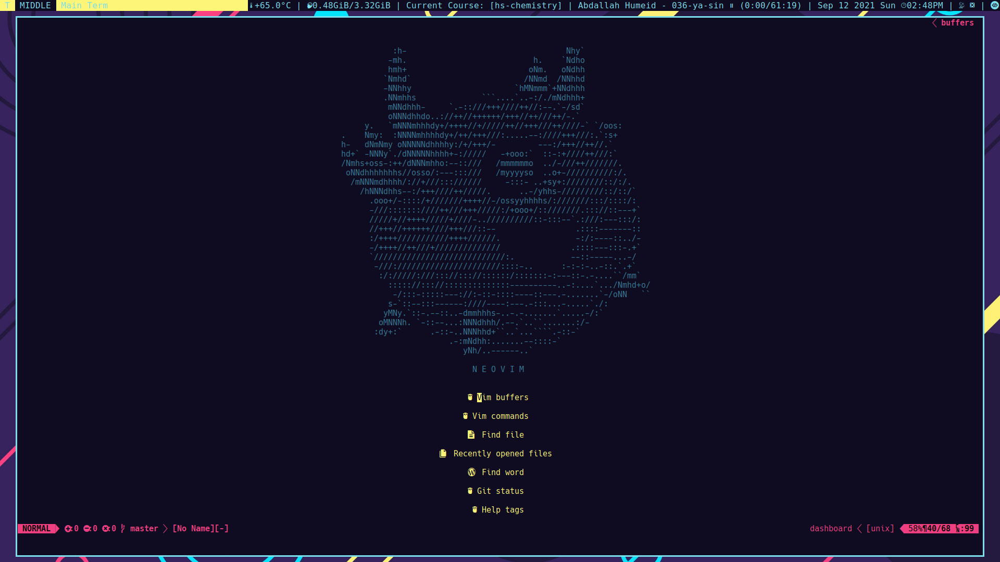
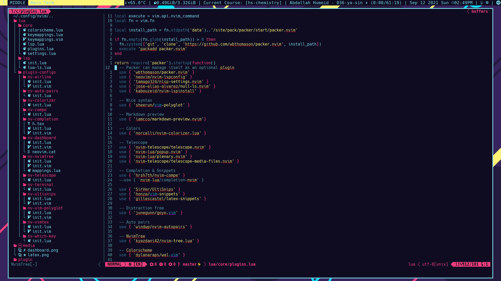
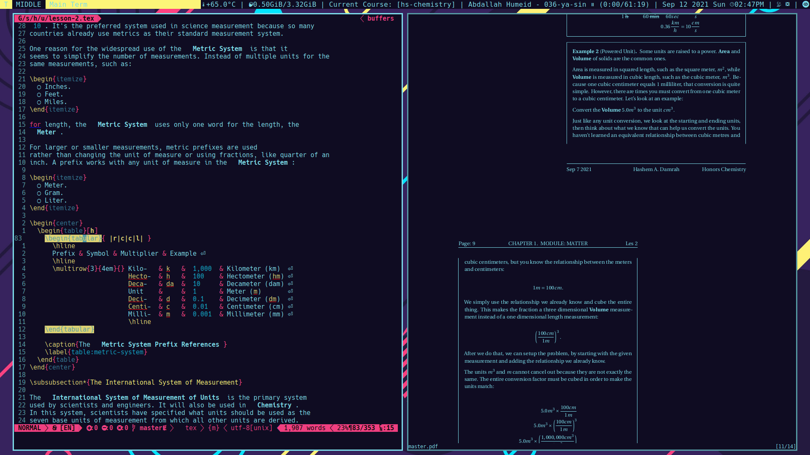

Death.NeoVim
============

# Gallery

## Dashboard



## Nvim-Tree



## Airline


## Statusbar


## Markdown


## LaTeX



## Fuzzy File Finder


## Translator


# Table of Contents

* [Gallery](#gallery)
    * [Dashboard](#dashboard)
    * [Nvim-Tree](#system)
    * [Airline](#airline)
    * [Markdown](#markdown)
    * [Statusbar](#statusbar)
    * [Markdown](#markdown)
    * [LaTeX](#latex)
    * [Fuzzy File Finder](#Fuzzy-file-finder)
    * [Translator](#translator)
* [Features](#features)
* [Overview](#overview)
* [Install In Three Lines](#install-in-three-lines)
* [Installation](#installation)
    * [Installing](#installing)
* [Usage](#usage)
    * [Keybindings](#keybindings)
			* [Basic key binds](#basic-key-binds)
				* [Browser](#browser)
				* [Git](#git)
				* [Translation](#translation)
				* [LaTeX](#latex)
				* [Misc](#misc)
    * [All of my plugins](#all-of-my-plugins)
* [TODO](#todo)

# Features

TODO: Must add features

# Overview

I switched from `Vim-Plug` to `Packer`, which was an investment worth doing because when I used `Vim-Plug`, I had like 87 plugins, which took about 4-5 seconds to boot up.
But now with `Packer`, it only takes 0.5 seconds, but I also lowered the number of plugins down to 29. (My main goal is to have all plugins written in `lua` because I **HATE** `vimscript`)

# Install In Three Lines

> ⚠️  WARNING: Make sure you have the latest version of NeoVim. (at the time, that is 0.5.0)

## Installing

Right now, it only works on linux (32 bit and 64 bit).

But before doing that, make sure you back-up your neovim configuration just in case. You do that with:

```sh
cp ~/.config/nvim ~/.config/nvim-backup
git clone https://https://github.com/SingularisArt/Death.NeoVim ~/.config/nvim
cd ~/.config/nvim && ./script
```
# Usage

## Keybindings

### Basic key binds

| Function                                | Keybind         |
| --------------------------------------- | --------------- |
| Leader Key                              | `SPACE`         |

### Browser

| Function        | Keybind      |
| --------------- | ------------ |
| :NvimTreeToggle | `<Leader>e`  |

### Navigation

| Function                                      | Keybind                   |
| --------------------------------------------- | ------------------------- |
| Navigate to left window                       | `Ctrl+h`                  |
| Navigate to right window                      | `Ctrl+l`                  |
| Navigate to top window                        | `Ctrl+k`                  |
| Navigate to bottom window                     | `Ctrl+j`                  |
| Next tab                                      | `Tab`                     |
| Previous tab                                  | `Shift+Tab`               |
| Only window                                   | `<Leader>o`               |
| New tab                                       | `<Leader>t`               |
| Horizontal split                              | `<Leader>s`               |
| Horizontal vsplit                             | `<Leader>v`               |
| Kill buffer                                   | `<Leader>bk`              |

### Git

| Function                                | Keybind         |
| --------------------------------------- | --------------- |
| :Gstatus                                | `<Leader>gs`    |
| :Gdiffsplit                             | `<Leader>gd`    |
| :Gcommit                                | `<Leader>gc`    |
| :Gpush                                  | `<Leader>gp`    |
| :Gpull                                  | `<Leader>gP`    |
| :Gmove                                  | `<Leader>gm`    |
| :Gmerge                                 | `<Leader>gM`    |
| :Gbrowse                                | `<Leader>gb`    |

### Translation

| Function                                | Keybind         |
| --------------------------------------- | --------------- |
| :Translate                              | `<Leader>t`     |
| :TranslateW                             | `<Leader>tw`    |
| :TranslateR                             | `<Leader>tr`    |

### LaTeX

| Function                                | Keybind         |
| --------------------------------------- | --------------- |
| :VimtexCompile                          | `<Leader>lc`    |
| :VimtexCompileSelected                  | `<Leader>ls`    |
| :VimtexInfo                             | `<Leader>li`    |
| :VimtexTocToggle                        | `<Leader>lt`    |
| :VimtexView                             | `<Leader>lv`    |

### Misc

| Function                                | Keybind         |
| --------------------------------------- | --------------- |
| :MarkdownPreview                        | `<Leader>md`    |

Check [here](lua/core/keymappings.lua) for all of the mappings.

## All of my plugins

- [lspconfig](https://github.com/neovim/nvim-lspconfig) - For lsp stuff.
- [polyglot](https://github.com/sheerun/vim-polyglot) - Better syntax and easier than **TreeSitter**.
- [telescope](https://github.com/nvim-telescope/telescope.nvim) - Fuzzy file finder.
- [popup](https://github.com/nvim-lua/popup.nvim) - Needed for **Telescope**.
- [plenary](https://github.com/nvim-lua/plenary.nvim) - Also needed for **Telescope**.
- [compe](https://github.com/hrsh7th/nvim-compe) - Autosuggestions (very cool).
- [ultisnips](https://github.com/SirVer/UltiSnips) - Snippet manager.
- [vim-snippets](https://github.com/honza/vim-snippets) - Snippets.
- [tabnine](https://github.com/codota/tabnine-vim) - AI Autocomplete.
- [goyo](https://github.com/junegunn/goyo.vim) - Goyo is distraction free.
- [autopairs](https://github.com/windwp/nvim-autopairs) - Auto pairing my brackets.
- [nvim-tree](https://github.com/kyazdani42/nvim-tree.lua) - File browser.
- [wal](https://github.com/dylanaraps/wal.vim) - My colorscheme (to go along with my system colorscheme).
- [which-key](https://github.com/folke/which-key.nvim) - Helps me remember my keys.
- [comment](https://github.com/terrortylor/nvim-comment) - Comments stuff quickly (I don't know how to use it though).
- [icons](https://github.com/kyazdani42/nvim-web-devicons) - Nice icons for items such as NvimTree.
- [status bar](https://github.com/vim-airline/vim-airline) - My nice statusbar.
- [dashboard](https://github.com/glepnir/dashboard-nvim) - Nice startup thing.
- [terminal](https://github.com/akinsho/nvim-toggleterm.lua) - Quick terminal popup.
- [show indent](https://github.com/Yggdroot/indentLine) - Shows indentation in a nice way.
- [translators](https://github.com/voldikss/vim-translator) - Translats things.
- [lua dev](https://github.com/folke/lua-dev.nvim) - Nice plugin for lua development.
- [syntax errors](https://github.com/folke/trouble.nvim) - Kind of like syntastic, but better.
- [tags](https://github.com/simrat39/symbols-outline.nvim) Kind of like tag bar, but better.
- [wildmenu](https://github.com/gelguy/wilder.nvim) - Nicer wildmenu.
- [LaTeX](https://github.com/lervag/vimtex) - LaTeX support.
- [lazygit](https://github.com/kdheepak/lazygit.nvim) - Lazygit within vim (Now that's cool).
- [markdown](https://github.com/iamcco/markdown-preview.nvim) - Markdown view.
- [cursors](https://github.com/terryma/vim-multiple-cursors) - Multi cursor (kind of like **atom**)
- [vimtex](https://github.com/lervag/vimtex) - Makes better highlighting.
- [conceal](https://github.com/KeitaNakamura/tex-conceal.vim) - Does something.

# TODO

- [x] Add all of my plugins.
- [ ] Setup neovim for taking notes in **LaTeX**.
- [ ] Add **features** to **README.md**.
- [ ] Add **requirements** to **README.md**.
- [ ] Get completion using either **Native LSP** or **COC**.
- [ ] Add snippets.
- [ ] Add tabnine.
- [ ] Add git signs in the gutter area.

