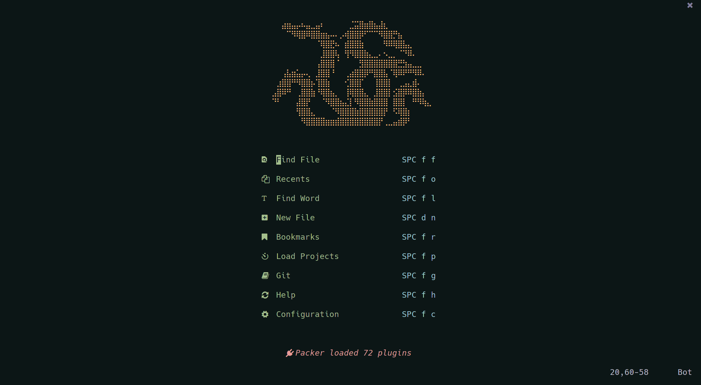
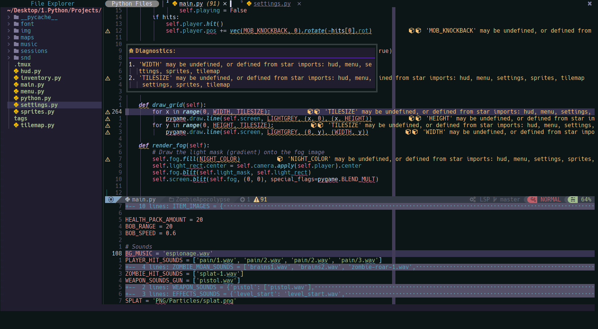
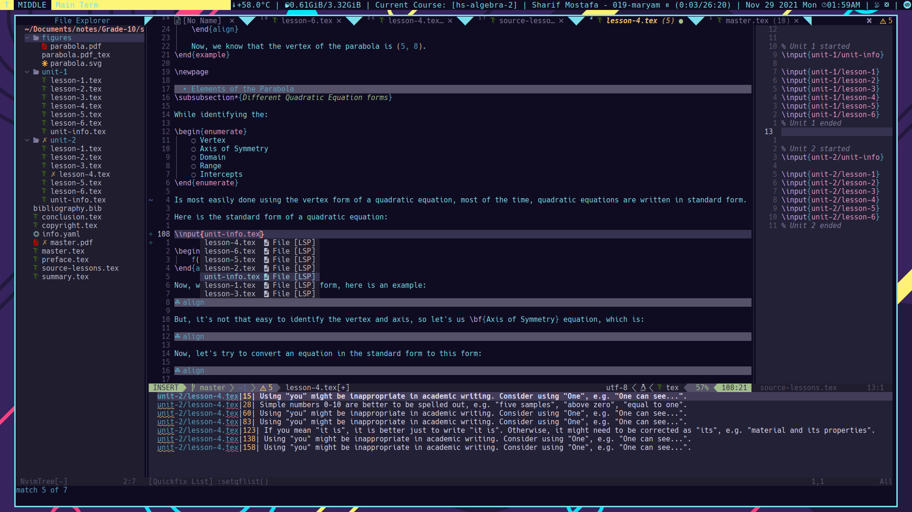
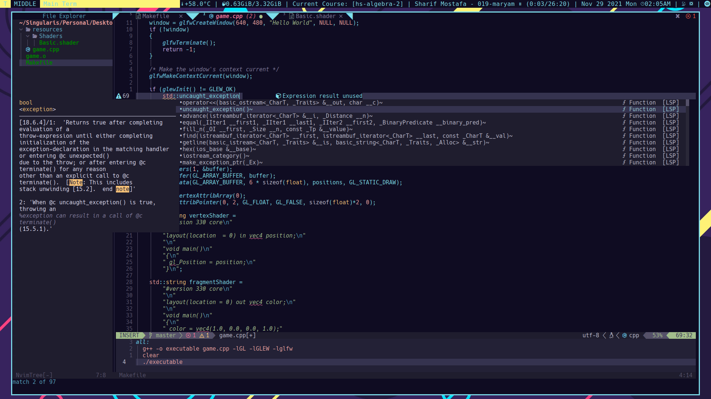
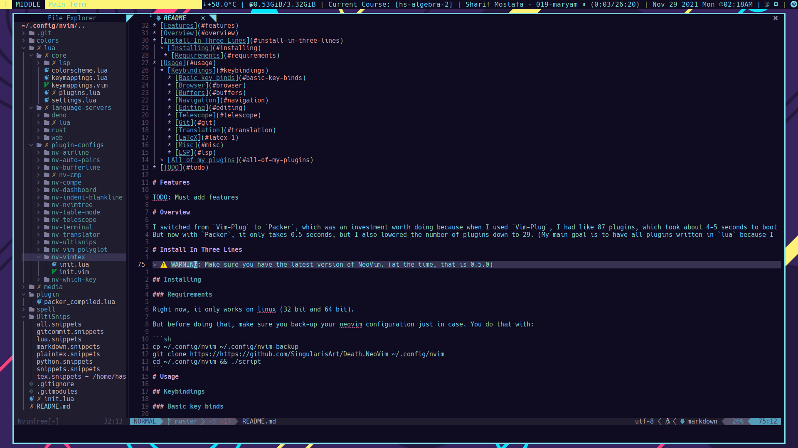
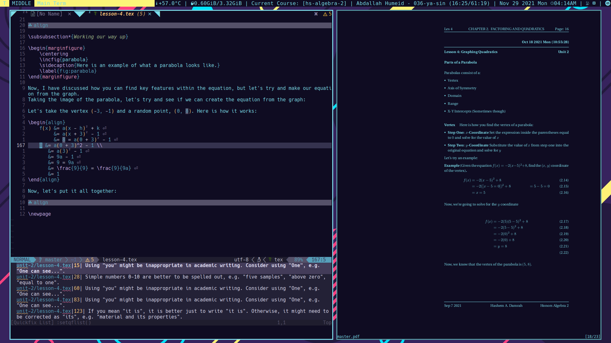
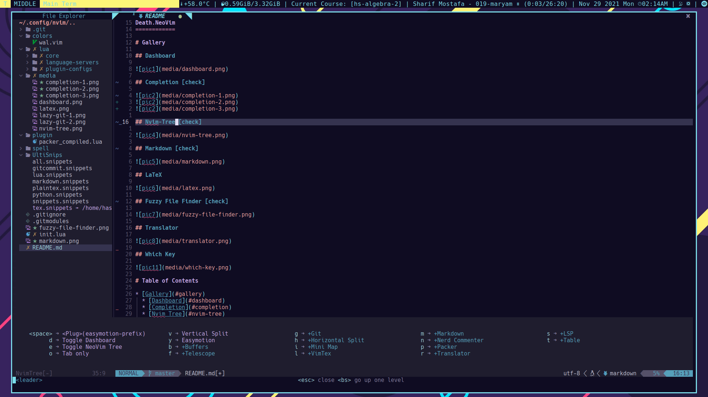

Death.NeoVim
============

# Screenshots










* [Screenshots](#screenshots)
* [Features](#features)
  * [LSP](#lsp)
* [Overview](#overview)
* [Install In Three Lines](#install-in-three-lines)
  * [Installing](#installing)
   * [Requirements](#requirements)
* [Usage](#usage)
  * [Keybindings](#keybindings)
    * [Basic key binds](#basic-key-binds)
    * [Browser](#browser)
    * [Buffers](#buffers)
    * [Navigation](#navigation)
    * [Editing](#editing)
    * [Telescope](#telescope)
    * [Git](#git)
    * [Translation](#translation)
    * [Dashboard](#dashboard)
    * [LaTeX](#latex-1)
    * [Misc](#misc)
    * [LSP](#lsp)
* [TODO](#todo)

# Install Language support

You can find a list of supported languages
[here](https://github.com/kabouzeid/nvim-lspinstall/tree/main/lua/lspinstall/servers).

To install any of them run

* Enter `:LspInstall` followed by <TAB> to see your options for LSP
* Enter `:TSInstall` followed by <TAB> to see your options for syntax highlighting

# Overview

I switched from `Vim-Plug` to `Packer`, which was an investment worth doing because when I used `Vim-Plug`, I had like 87 plugins, which took about 4-5 seconds to boot up.
But now with `Packer`, it only takes 0.5 seconds, but I also lowered the number of plugins down to 29. (My main goal is to have all plugins written in `lua` because I **HATE** `vimscript`)

# Install In Three Lines

> ⚠️  WARNING: Make sure you have the latest version of NeoVim. (at the time, that is 0.5.0)

## Installing

### Requirements

Right now, it only works on linux (32 bit and 64 bit).

But before doing that, make sure you back-up your neovim configuration just in case. You do that with:

```sh
cp ~/.config/nvim ~/.config/nvim-backup
git clone https://https://github.com/SingularisArt/Death.NeoVim ~/.config/nvim
```
# Usage

## Keybindings

### Basic key binds

| Function       | Keybind         |
| -------------- | --------------- |
| Leader Key     | `SPACE`         |

### Browser

| Function              | Keybind      |
| --------------------- | ------------ |
| :NvimTreeToggle       | `<Leader>e`  |
| Create new tab        | `<A-t>`      |
| Remove tab            | `<A-w>`      |
| Go to next Diagnostic | `[d`         |
| Go to prev Diagnostic | `]d`         |

### Buffers

| Function                           | Keybind        |
| ---------------------------------- | -------------- |
| :BufferLinePick                    | `<Leader>bp`   |
| :BufferLineCloseLeft               | `<Leader>bcl`  |
| :BufferLineCloseRight              | `<Leader>bcr`  |
| :BufferLineMoveNext                | `<Leader>bmn`  |
| :BufferLineMovePrev                | `<Leader>bmp`  |
| :BufferLineSortByDirectory         | `<Leader>bsd`  |
| :BufferLineSortByExtension         | `<Leader>bse`  |
| :BufferLineSortByRelativeDirectory | `<Leader>bsr`  |
| :BufferLineSortByTabs              | `<Leader>bst`  |

### Navigation

| Function                      | Keybind                   |
| ----------------------------- | ------------------------- |
| Navigate to left window       | `Ctrl+h`                  |
| Navigate to right window      | `Ctrl+l`                  |
| Navigate to top window        | `Ctrl+k`                  |
| Navigate to bottom window     | `Ctrl+j`                  |
| Next tab                      | `Tab`                     |
| Previous tab                  | `Shift+Tab`               |
| Only window                   | `<Leader>o`               |
| New tab                       | `<A-t>`                   |
| Kill buffer                   | `<A-w>`                   |
| Horizontal split              | `<Leader>h`               |
| Horizontal vsplit             | `<Leader>v`               |
| Easymotion                    | `<Leader>y`               |

### Editing

| Function                 | Keybind                   |
| ------------------------ | ------------------------- |
| :TableModeToggle         | `<Leader>tt`              |
| :TableAddFormula         | `<Leader>taf`             |
| Delete Table Row         | `<Leader>tdr`             |
| Delete Table Column      | `<Leader>tdc`             |
| Insert Table Column      | `<Leader>tic`             |
| NERDComment toggle       | `<Leader>nc`              |
| NERDComment un-toggle    | `<Leader>nu`              |
| Fix misspelled words     | `<C-l> INSERT MODE`       |

### Telescope

| Function                 | Keybind                   |
| ------------------------ | ------------------------- |
| :Telescope find_files    | `<Leader>ff`              |
| :Telescope oldfiles      | `<Leader>fo`              |
| :Telescope colorscheme   | `<Leader>fc`              |
| :Telescope buffers       | `<Leader>fb`              |
| :Telescope commands      | `<Leader>fm`              |
| :Telescope quick_fix     | `<Leader>fq`              |
| :Telescope live_grep     | `<Leader>fl`              |
| :Telescope marks         | `<Leader>fr`              |
| :Telescope projects      | `<Leader>fp`              |
| :Telescope git_status    | `<Leader>fgs`             |
| :Telescope git_files     | `<Leader>fgf`             |
| :Telescope git_commits   | `<Leader>fgc`             |
| :Telescope git_branches  | `<Leader>fgb`             |
| :Telescope git_stash     | `<Leader>fgt`             |

### Git

| Function        | Keybind         |
| --------------- | --------------- |
| :Git            | `<Leader>gs`    |
| :Git add .      | `<Leader>ga`    |
| :Git diff       | `<Leader>gd`    |
| :Git commit     | `<Leader>gc`    |
| :Git push       | `<Leader>gp`    |
| :Git pull       | `<Leader>gP`    |
| :Git log        | `<Leader>gl`    |
| :LazyGit        | `<Leader>gL`    |
| :LazyGitFilter  | `<Leader>gf`    |

### Translation

| Function        | Keybind         |
| ----------------| --------------- |
| :Translate      | `<Leader>rt`    |
| :TranslateW     | `<Leader>rw`    |
| :TranslateR     | `<Leader>rr`    |

### Dashbaord

| Function          | Keybind         |
| ----------------- | --------------- |
| :Dashbaord        | `<Leader>dd`    |
| :DashboardNewFile | `<Leader>dn`    |

### LaTeX

| Function                   | Keybind         |
| -------------------------- | --------------- |
| :VimtexCompile             | `<Leader>lc`    |
| :VimtexCompileSelected     | `<Leader>ls`    |
| :VimtexInfo                | `<Leader>li`    |
| :VimtexTocToggle           | `<Leader>lt`    |
| :VimtexView                | `<Leader>lv`    |

### Misc

| Function            | Keybind         |
| ------------------- | --------------- |
| :MarkdownPreview    | `<Leader>mp`    |

### LSP

| Function                   | Keybind         |
| -------------------------- | --------------- |
| Go to next Diagnostic      | `[d`            |
| Go to prev Diagnostic      | `]d`            |
| Open/Close Terminal        | `<Alt-d>`       |
| Hover Doc                  | `<Leader>sh`    |
| Rename                     | `<Leader>sr`    |
| Code Action                | `<Leader>sc`    |
| Show Diagnostics           | `<Leader>se`    |
| Error Localist             | `<Leader>sq`    |
| Format                     | `<Leader>sf`    |
| Implement                  | `<Leader>si`    |
| Go to Definition           | `<Leader>sdd`   |
| Find files with Definition | `<Leader>sdf`   |
| Find References            | `<Leader>sdr`   |
| Type Definition            | `<Leader>sdt`   |
| Preview Definition         | `<Leader>sdp`   |
| Add workspace              | `<Leader>swa`   |
| Remove workspace           | `<Leader>swr`   |

Check [here](lua/core/keymappings.lua) for all of the mappings.

# TODO

- [x] Setup neovim for taking notes in **LaTeX**.
- [x] Add git signs in the gutter area.
- [x] Add snippets.
- [x] Add **requirements** to **README.md**.
- [x] Get completion using either **Native LSP** or **COC**.
- [x] Add **features** to **README.md**.
- [x] Add tabnine.
- [ ] Make my own executable called **dvim**.

