<p align="center">💀 A Hackable, Fully Featured, Rice Friendly NeoVim Configuration 💀</p>

<p align="center">
  <a href="#features">Features</a> •
  <a href="#installation">Installation</a> •
  <a href="#usage">Usage</a> •
  <a href="#showcase">Showcase</a> •
  <a href="#required-tools">Required Tools</a> •
  <a href="#todo">TODO</a>
  <br>
  <br>
  <a href="https://github.com/SingularisArt/Death.NeoVim/stargazers">
    
  </a>
  <a href="https://github.com/SingularisArt/Death.NeoVim/commits/master">
    
  </a>
  <a href="https://github.com/SingularisArt/Death.NeoVim.svg">
    
  </a>

<p align="center">
  
</p>

# Features

* Blazing fast
* Written in 100% **LUA**
* Has TreeSitter syntax highlighting
* Colorscheme generated with [pywal](https://github.com/dylanaraps/pywal)
* Intellisense, Completion, Linting, and Debugging
* Easily able to install LSP Servers and DAP Servers using `:LspInstall` and
  `:DPInstall`
* Git integration with [vim-fugitive](https://github.com/tpope/vim-fugitive)
  and [vim-gitgutter](https://github.com/airblade/vim-gitgutter)
* Informative statusline and tabline with
  [bufferline.nvim](https://github.com/akinsho/bufferline.nvim)
* Code snippets powered by [UltiSnips](https://github.com/SirVer/ultisnips)
* Intelligent suggestions with
  [vim-tabnine](https://github.com/zxqfl/tabnine-vim) and
  [vim-copilot](https://github.com/github/copilot.vim)
* Simple file browsing with
  [NvimTree](https://github.com/kyazdani42/nvim-tree.lua)
* Dynamic homepage with [alpha-vim](https://github.com/goolord/alpha-nvim)
* Blur inactive panes using [vimade](https://github.com/TaDaa/vimade)
* Distraction free writing with
  [ZenMode](https://github.com/folke/zen-mode.nvim) and
  [Twilight](https://github.com/folke/twilight.nvim)
* Easily configurable to suit your needs
* Common sense keybindings
* Support [Which-Key](https://github.com/folke/which-key.nvim) so you never
  forget your keybindings
* Enhanced editing with the use of the [top plugins](#very-useful-plugins)

# Installation

> ⚠️  WARNING: Make sure you have the latest version of NeoVim. (at the time,
> that is 0.7.0)

```sh
mv ~/.config/nvim ~/.config/nvim-back
git clone https://https://github.com/SingularisArt/Death.NeoVim ~/.config/nvim
```

## Install Language support

You can find a list of supported languages
[here](https://github.com/kabouzeid/nvim-lspinstall/tree/main/lua/lspinstall/servers).

To install any of them run

* Enter `:LspInstall` followed by `<TAB>` to see your options for LSP
* Enter `:TSInstall` followed by `<TAB>` to see your options for syntax
  highlighting

# Usage

## Keybindings

<details><summary><code>Basic Key-Bindings</code></summary>
<p>
  
| Function                                | Keybind           |
| --------------------------------------- | ---------------   |
| Leader Key                              | `SPACE`           |
| Create a new tab                        | `Ctrl+t`          |
| Remove the current tab                  | `Ctrl+w`          |
| Toggle QuickFix                         | `Right Arrow`     |
| Close QuickFix                          | `Left Arrow`      |
| Previous QuickFix item                  | `Up Arrow`        |
| Next QuickFix item                      | `Down Arrow`      |
| Format file                             | `Ctrl+s`          |
| Correct a misspelled word               | `Ctrl+l`          |
| Create a vertical split                 | `<Leader>+v`      |
| Create a horizontal split               | `<Leader>+h`      |
| Close all splits                        | `<Leader>+o`      |
| Highlight everything                    | `Ctrl+a`          |
| Move text up                            | `J` (VISUAL MODE) |
| Move text down                          | `K` (VISUAL MODE) |
| Move text up                            | `<Leader>j`       |
| Move text down                          | `<Leader>k`       |
| Open NvimTree                           | `<Leader>e`       |
| Toggle easymotion                       | `<Leader>y`       |
| Toggle SymbolsOutline                   | `<Leader>u`       |

</p>
</details>

<details><summary><code>Packer</code></summary>
<p>
  
| Function                                | Keybind         |
| --------------------------------------- | --------------- |
| Install plugins                         | `<Leader>pi`    |
| Update plugins                          | `<Leader>pu`    |
| Clean plugins                           | `<Leader>pc`    |
| Load plugins                            | `<Leader>pl`    |
| Sync plugins                            | `<Leader>ps`    |
| Bring profile                           | `<Leader>pp`    |

</p>
</details>

<details><summary><code>Buffers</code></summary>
<p>
  
| Function                                | Keybind         |
| --------------------------------------- | --------------- |
| Pick from the buffers                   | `<Leader>bp`    |
| Close all buffers to the left           | `<Leader>bcl`   |
| Close all buffers to the right          | `<Leader>bcr`   |
| Move buffer next                        | `<Leader>bmn`   |
| Move buffer previous                    | `<Leader>bmp`   |
| Sort buffers by directory               | `<Leader>bsd`   |
| Sort buffers by extension               | `<Leader>bse`   |
| Sort buffers by relative directory      | `<Leader>bsr`   |
| Sort buffers by tabs                    | `<Leader>bst`   |

</p>
</details>

<details><summary><code>Git</code></summary>
<p>
  
| Function                                | Keybind         |
| --------------------------------------- | --------------- |
| Git status                              | `<Leader>gs`    |
| Git add                                 | `<Leader>ga`    |
| Git commit                              | `<Leader>gc`    |
| Git push                                | `<Leader>gp`    |
| Git pull                                | `<Leader>gP`    |
| Git log                                 | `<Leader>gl`    |
| Git diff                                | `<Leader>gd`    |
| Lazy Git                                | `<Leader>gL`    |
| Lazy Git Filter                         | `<Leader>gf`    |

</p>
</details>

<details><summary><code>Translate</code></summary>
<p>
  
| Function                                | Keybind         |
| --------------------------------------- | --------------- |
| Show the translation in the cmd line    | `<Leader>Rt`    |
| Show the translation in a pop-up        | `<Leader>Rw`    |
| Convert the word to the translated word | `<Leader>Rr`    |

</p>
</details>

<details><summary><code>LaTeX</code></summary>
<p>
  
| Function                                | Keybind         |
| --------------------------------------- | --------------- |
| Clean                                   | `<Leader>lll`   |
| Clean Cache                             | `<Leader>llc`   |
| Compile                                 | `<Leader>lcc`   |
| Compile and show output                 | `<Leader>lco`   |
| Compile and show SS                     | `<Leader>lcs`   |
| Compile selected                        | `<Leader>lce`   |
| Reload                                  | `<Leader>lrr`   |
| Reload state                            | `<Leader>lrs`   |
| Stop                                    | `<Leader>lop`   |
| Stop all                                | `<Leader>loa`   |
| Show TOC                                | `<Leader>ltt`   |
| Show context menu                       | `<Leader>lm`    |
| Count letters                           | `<Leader>lu`    |
| Count words                             | `<Leader>lw`    |
| Document package                        | `<Leader>ld`    |
| Errors                                  | `<Leader>le`    |
| Status                                  | `<Leader>ls`    |
| View pdf                                | `<Leader>vl`    |
| Info                                    | `<Leader>li`    |

</p>
</details>

<details><summary><code>Markdown</code></summary>
<p>
  
| Function                                | Keybind         |
| --------------------------------------- | --------------- |
| Preview markdown                        | `<Leader>mp`    |

</p>
</details>

<details><summary><code>Table</code></summary>
<p>
  
| Function                                | Keybind         |
| --------------------------------------- | --------------- |
| Toggle table mode                       | `<Leader>tt`    |
| Delete row                              | `<Leader>tdd`   |
| Delete column                           | `<Leader>tdc`   |
| Insert column                           | `<Leader>tic`   |
| Add formula                             | `<Leader>tfa`   |
| Evaluate the formula on the current row | `<Leader>tfe`   |
| Get cell info                           | `<Leader>tn`

</p>
</details>

<details><summary><code>Telescope</code></summary>
<p>
  
| Function                                | Keybind         |
| --------------------------------------- | --------------- |
| Find files                              | `<Leader>fff`   |
| Find files using a file browser         | `<Leader>ffb`   |
| Git status                              | `<Leader>fgs`   |
| Git commits                             | `<Leader>fgc`   |
| Git branches                            | `<Leader>fgb`   |
| Git stash                               | `<Leader>fgt`   |
| Look through old files                  | `<Leader>fo`    |
| Go through the colorschemes             | `<Leader>fc`    |
| Go through buffers                      | `<Leader>fb`    |
| Go through commands                     | `<Leader>fm`    |
| Go through the QuickFix list            | `<Leader>fq`    |
| Do a live grep                          | `<Leader>fl`    |
| Go through marks                        | `<Leader>fm`    |
| Go through projects                     | `<Leader>fp`    |

</p>
</details>

<details><summary><code>Debugging</code></summary>
<p>
  
| Function                                | Keybind         |
| --------------------------------------- | --------------- |
| Start debug session                     | `<Leader>ds`    |
| Conditional breakpoint                  | `<Leader>dC`    |
| Toggle breakpoint                       | `<Leader>db`    |
| Toggle UI                               | `<Leader>dU`    |
| Continue                                | `<Leader>dc`    |
| Step back                               | `<Leader>db`    |
| Step into                               | `<Leader>di`    |
| Step over                               | `<Leader>do`    |
| Step out                                | `<Leader>du`    |
| Run to cursor                           | `<Leader>dR`    |
| Hover variable                          | `<Leader>dh`    |
| Get session                             | `<Leader>dg`    |
| Evaluate                                | `<Leader>de`    |
| Evaluate input                          | `<Leader>dE`    |
| Toggle repl                             | `<Leader>dr`    |
| Scopes                                  | `<Leader>dS`    |
| Pause                                   | `<Leader>dp`    |
| Disconnect                              | `<Leader>dd`    |
| Quit                                    | `<Leader>dq`    |
| Terminate                               | `<Leader>dx`    |

</p>
</details>

<details><summary><code>LSP</code></summary>
<p>
  
| Function                                 | Keybind         |
| ---------------------------------------- | --------------- |
| Go to definition                         | `<Leader>sdd`   |
| Show references                          | `<Leader>sdr`   |
| Get type definition                      | `<Leader>sdt`   |
| Show definition preview in pop-up window | `<Leader>sdp`   |
| Add workspace                            | `<Leader>swa`   |
| Remove workspace                         | `<Leader>swr`   |
| Show documentation                       | `<Leader>sh`    |
| Show code actions                        | `<Leader>sc`    |
| Show line diagnostics                    | `<Leader>se`    |
| Show QuickFix list                       | `<Leader>sq`    |
| Format                                   | `<Leader>sf`    |
| Rename                                   | `<Leader>sr`    |
| Go to implementation                     | `<Leader>si`    |
| Go to next diagnostic                    | `<Leader>sj`    |
| Go to prev diagnostic                    | `<Leader>sk`    |
| Close all windows                        | `<Leader>sC`    |

</p>
</details>

## Showcase

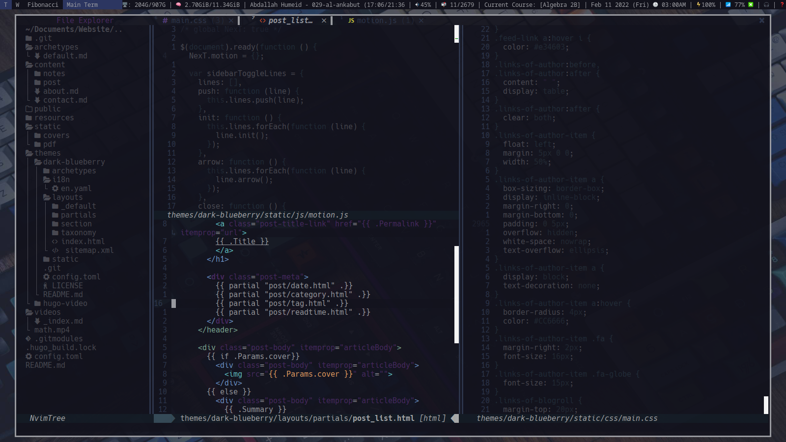
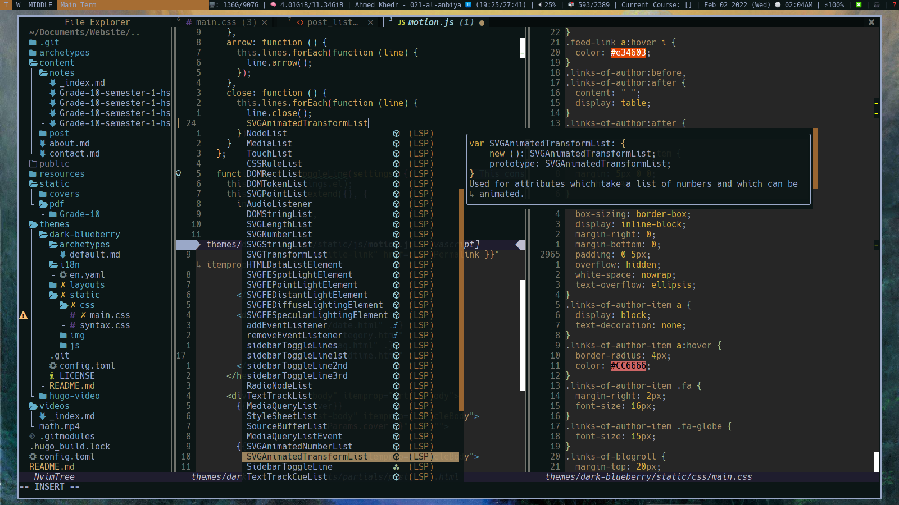

### Theme Showcase

<details><summary>Images</summary>
  
  
  
</details>

### Very useful plugins

<details><summary>Images</summary>
  <h3>Alpha</h3>
  Nice start when you open nvim without passing any arguments.

  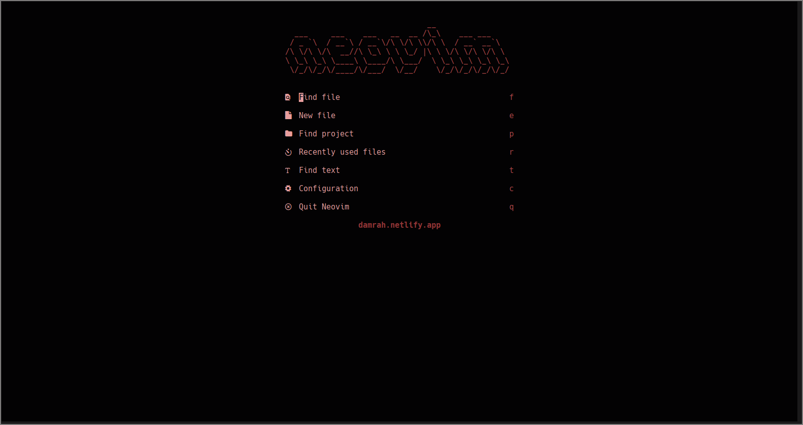

  <h3>Nvim Tree</h3>
  Fast file tree:<br>

  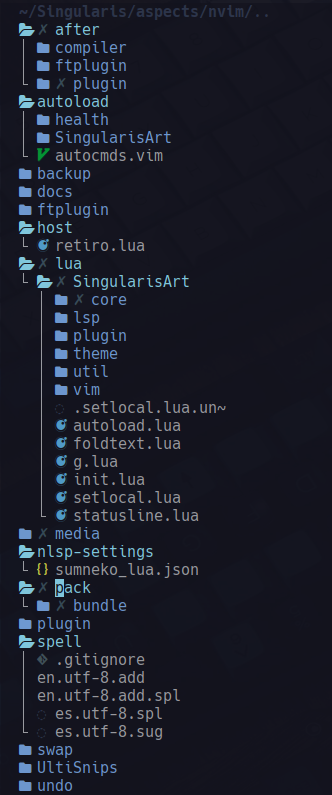

  <h3>Telescope-nvim</h3>
  A fuzzy file finder, picker, sorter, previewer and much more:<br>

  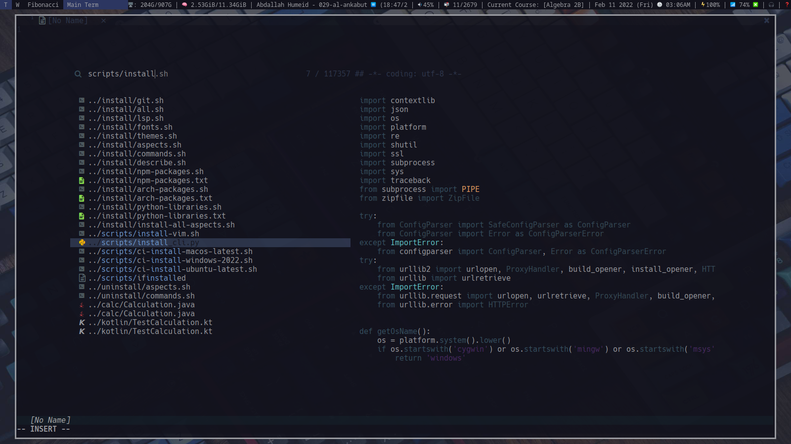

  <h3>Nvim-bufferline.lua</h3>
  Better tab implementation:<br>

  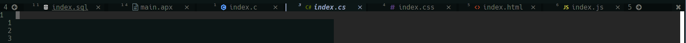

  <h3>Nvim-web-devicons</h3>
  Lua fork of Vim Devicons which offers more file icon customisability:<br>

  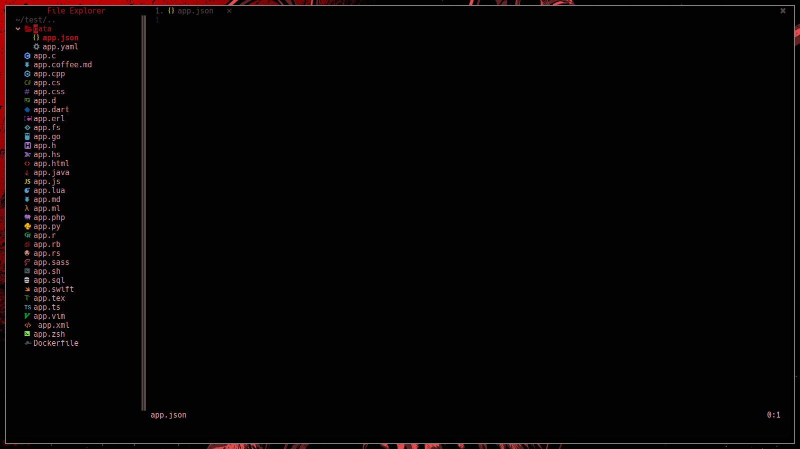

  <h3>Nvim-treesitter</h3>
  Better syntax highlighting for programming languages

  Without/with TreeSitter:<br>

  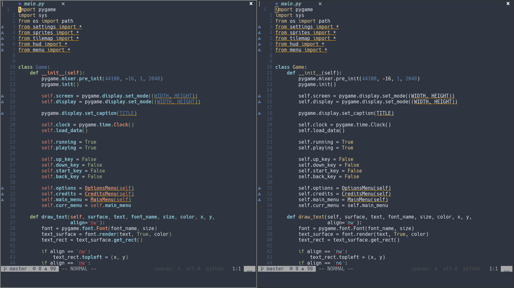
</details>

### Completion

<details><summary>Images</summary>
</details>

### Filetypes

<details><summary>Images</summary>
  <h3>Python</h3>
  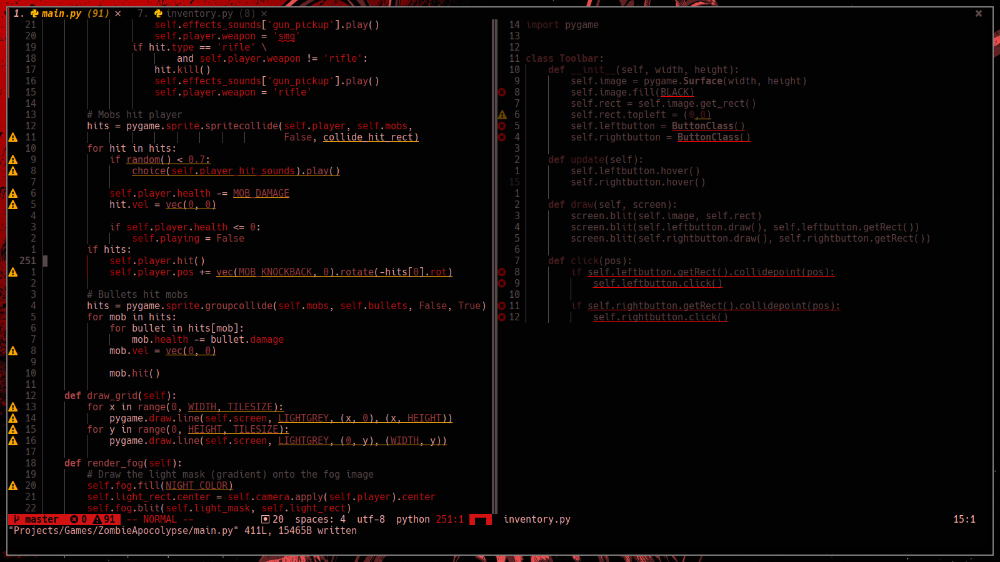

  <h3>C++</h3>
  

  <h3>C#</h3>
  

  <h3>C</h3>
  

  <h3>MySQL</h3>
  

  <h3>HTML</h3>
  

  <h3>CSS</h3>
  

  <h3>JavaScript</h3>
  

  <h3>TypeScript</h3>
  

  <h3>Php</h3>
  

  <h3>Ruby</h3>
  

  <h3>Perl</h3>
  

  <h3>Java</h3>
  

  <h3>Rust</h3>
  

  <h3>Solidity</h3>
  

  <h3>Bash</h3>
  

  <h3>Lua</h3>
  

  <h3>VimScript</h3>
  

  <h3>LaTeX</h3>
  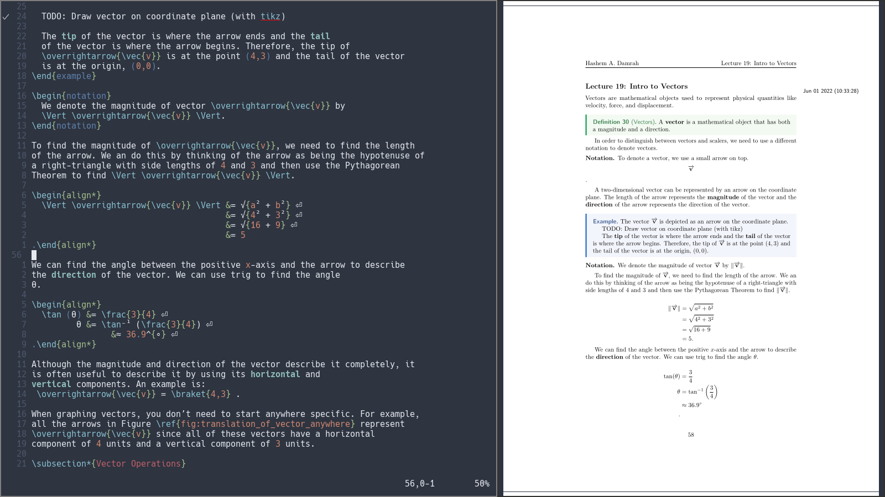

  <h3>Markdown</h3>
  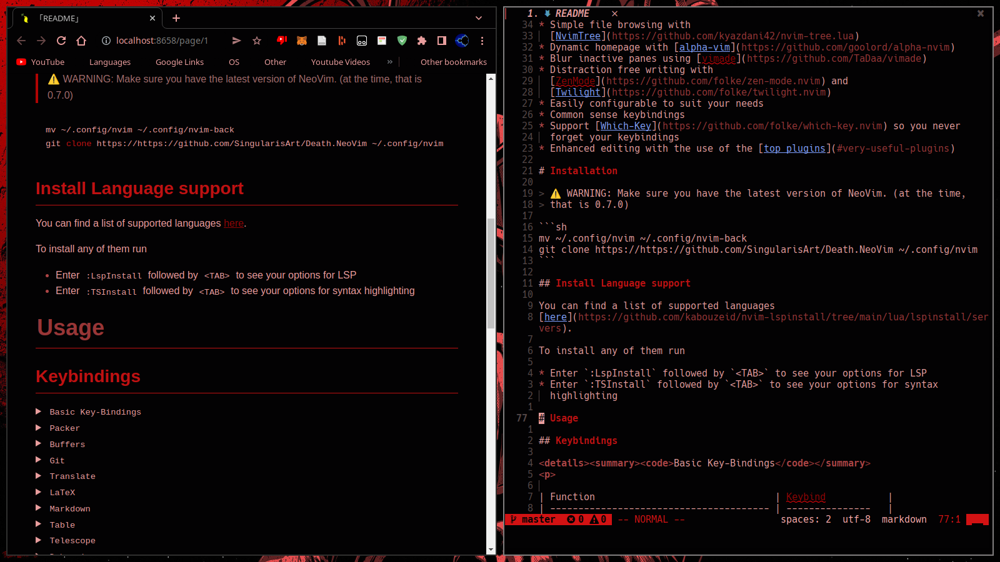
</details>

### Debugging

<details><summary>Images</summary>
  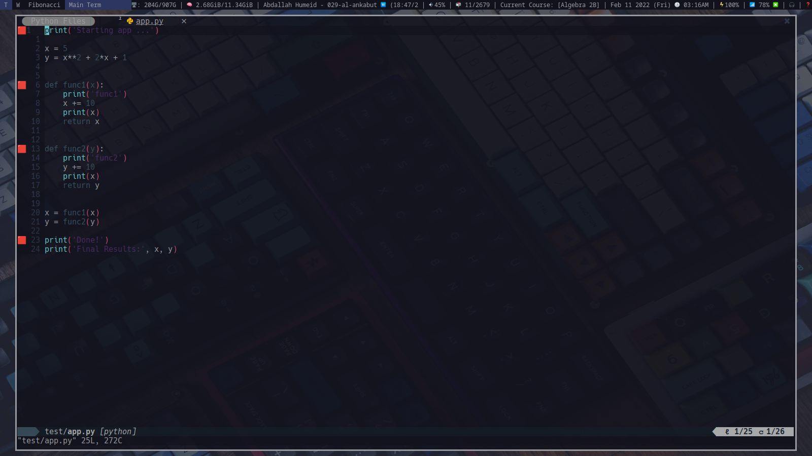
  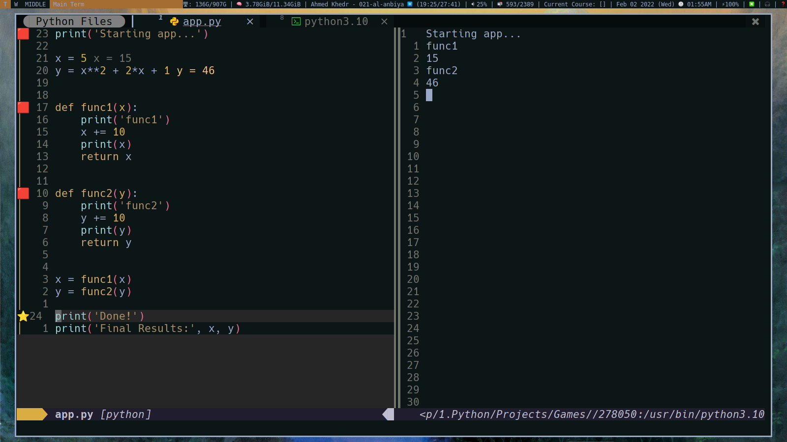
  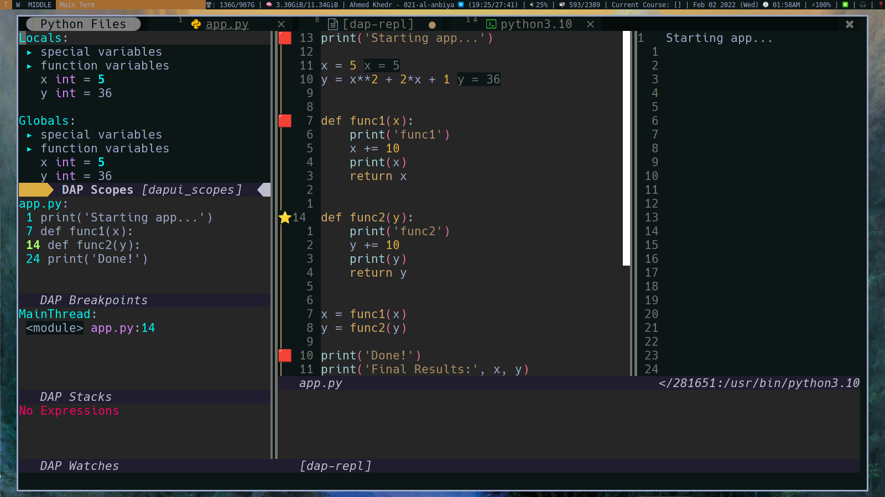
</details>

# Required Tools

These must be installed for you to be able to use all the features:

* [pywal](https://github.com/dylanaraps/pywal) for colorscheme
* [all these npm packages](https://github.com/SingularisArt/Singularis/blob/master/package.json#L6-L18) for lsp support

# TODO

## Completed

- [x] Setup NeoVim for taking notes in **LaTeX**.
- [x] Add git signs in the gutter area.
- [x] Add snippets.
- [x] Add **requirements** to **README.md**.
- [x] Get completion using either **Native LSP** or **COC**.
- [x] Add **features** to **README.md**.
- [x] Add TabNine.
- [x] Add GitHub copilot.

## Working on

- [ ] Add images
- [ ] Organize the structure of my `plugins.lua` file.

## Need to do

- [ ] Make my own executable called **dvim**.
