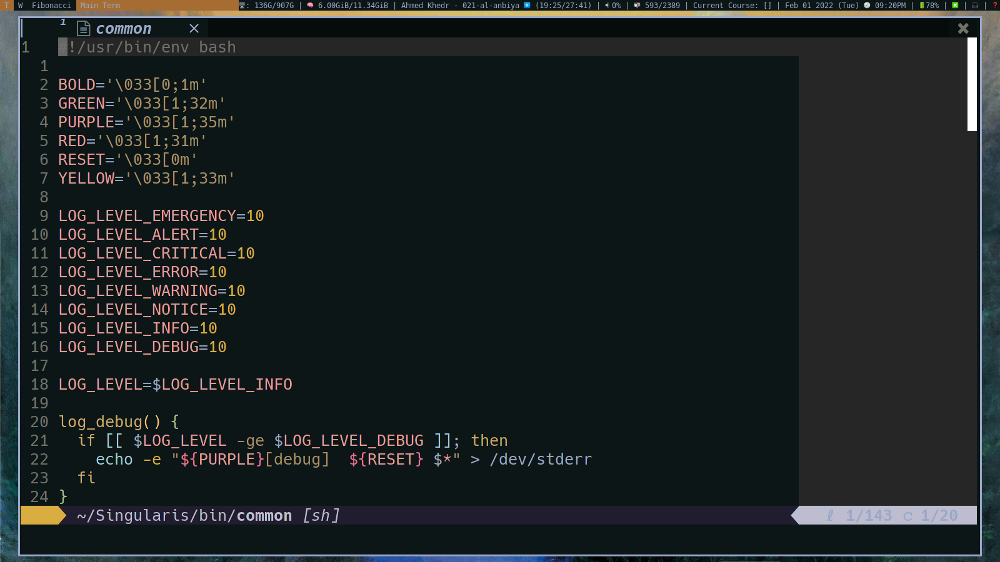

Death.NeoVim
============

This is a simple, but yet, elegant neovim setup.



Table of Contents
=================

* [Death.NeoVim](#deathneovim)
* [Install Language support](#install-language-support)
* [Installation](#installation)
   * [Requirements](#requirements)
* [Usage](#usage)
   * [Package Managers](#package-managers)
   * [Colorscheme](#colorscheme)
   * [Keybindings](#keybindings)
* [Showcase](#showcase)
   * [Theme Showcase](#theme-showcase)
   * [Very useful plugins used](#very-useful-plugins-used)
   * [Filetypes](#filetypes)
* [Contributing](#contributing)
* [TODO](#todo)
   * [Completed](#completed)
   * [Working on](#working-on)
   * [Need to do](#need-to-do)

# Install Language support

You can find a list of supported languages
[here](https://github.com/kabouzeid/nvim-lspinstall/tree/main/lua/lspinstall/servers).

To install any of them run

* Enter `:LspInstall` followed by `<TAB>` to see your options for LSP
* Enter `:TSInstall` followed by `<TAB>` to see your options for syntax
  highlighting

# Installation

> ⚠️  WARNING: Make sure you have the latest version of NeoVim. (at the time,
> that is 0.6.1)

## Requirements

Right now, it only works on Linux (32 bit and 64 bit).

But before doing that, make sure you back-up your NeoVim configuration just
in case. You do that with:

```sh
git clone https://https://github.com/SingularisArt/Death.NeoVim ~/.config/nvim && cd ~/.config/nvim && ./script
```

# Usage

## Package Managers

This NeoVim config doesn't use any plugin managers. I use `git submodules`.
You can view all of the plugins [here](pack/bundle/opt) and I source theme in
my [init.lua](./init.lua).

### Adding plugins

Here's how you add a plugin:

```bash
git submodule --name PLUGIN-NAME https://github.com/USER/PLUGIN-NAME pack/bundle/opt/PLUGIN-NAME
```

After you've add the submodule, add this to the `init.lua` file in the
section for the plugins:

```lua
SingularisArt.plugin.load('PLUGIN-NAME')
```

### Remove/Disable plugins

All you have to do to disable a plugin is to remove the calling from the
`init.lua` file.
If you want to permanently remove a plugin, remove it's submodule using the
following command:

```bash
git rm --cached pack/bundle/opt/PLUGIN-NAME
rm -rf pack/bundle/opt/PLUGIN-NAME
```

## Colorscheme

I use the `pywal` colorscheme, which uses the colors from the `wal` command.
[Here's](https://github.com/SingularisArt/Chameleon) a script that I forked
that will change your computer's entire system colorscheme based on your
wallpaper.

## Keybindings

### Basic key binds

| Function       | Keybind         |
| -------------- | --------------- |
| Leader Key     | `SPACE`         |

### Browser

| Function              | Keybind      |
| --------------------- | ------------ |
| :NvimTreeToggle       | `<Leader>e`  |
| Create new tab        | `<A-t>`      |
| Remove tab            | `<A-w>`      |
| Go to next Diagnostic | `[d`         |
| Go to prev Diagnostic | `]d`         |

### Buffers

| Function                           | Keybind        |
| ---------------------------------- | -------------- |
| :BufferLinePick                    | `<Leader>bp`   |
| :BufferLineCloseLeft               | `<Leader>bcl`  |
| :BufferLineCloseRight              | `<Leader>bcr`  |
| :BufferLineMoveNext                | `<Leader>bmn`  |
| :BufferLineMovePrev                | `<Leader>bmp`  |
| :BufferLineSortByDirectory         | `<Leader>bsd`  |
| :BufferLineSortByExtension         | `<Leader>bse`  |
| :BufferLineSortByRelativeDirectory | `<Leader>bsr`  |
| :BufferLineSortByTabs              | `<Leader>bst`  |

### Navigation

| Function                      | Keybind                   |
| ----------------------------- | ------------------------- |
| Navigate to left window       | `Ctrl+h`                  |
| Navigate to right window      | `Ctrl+l`                  |
| Navigate to top window        | `Ctrl+k`                  |
| Navigate to bottom window     | `Ctrl+j`                  |
| Next tab                      | `Tab`                     |
| Previous tab                  | `Shift+Tab`               |
| Only window                   | `<Leader>o`               |
| New tab                       | `<A-t>`                   |
| Kill buffer                   | `<A-w>`                   |
| Horizontal split              | `<Leader>h`               |
| Horizontal vsplit             | `<Leader>v`               |
| Easymotion                    | `<Leader>y`               |

### Editing

| Function                 | Keybind                   |
| ------------------------ | ------------------------- |
| :TableModeToggle         | `<Leader>tt`              |
| :TableAddFormula         | `<Leader>taf`             |
| Delete Table Row         | `<Leader>tdr`             |
| Delete Table Column      | `<Leader>tdc`             |
| Insert Table Column      | `<Leader>tic`             |
| NERDComment toggle       | `<Leader>nc`              |
| NERDComment un-toggle    | `<Leader>nu`              |
| Fix misspelled words     | `<C-l> INSERT MODE`       |

### Telescope

| Function                 | Keybind                   |
| ------------------------ | ------------------------- |
| :Telescope find_files    | `<Leader>ff`              |
| :Telescope oldfiles      | `<Leader>fo`              |
| :Telescope colorscheme   | `<Leader>fc`              |
| :Telescope buffers       | `<Leader>fb`              |
| :Telescope commands      | `<Leader>fm`              |
| :Telescope quick_fix     | `<Leader>fq`              |
| :Telescope live_grep     | `<Leader>fl`              |
| :Telescope marks         | `<Leader>fr`              |
| :Telescope projects      | `<Leader>fp`              |
| :Telescope git_status    | `<Leader>fgs`             |
| :Telescope git_files     | `<Leader>fgf`             |
| :Telescope git_commits   | `<Leader>fgc`             |
| :Telescope git_branches  | `<Leader>fgb`             |
| :Telescope git_stash     | `<Leader>fgt`             |

### Git

| Function        | Keybind         |
| --------------- | --------------- |
| :Git            | `<Leader>gs`    |
| :Git add .      | `<Leader>ga`    |
| :Git diff       | `<Leader>gd`    |
| :Git commit     | `<Leader>gc`    |
| :Git push       | `<Leader>gp`    |
| :Git pull       | `<Leader>gP`    |
| :Git log        | `<Leader>gl`    |
| :LazyGit        | `<Leader>gL`    |
| :LazyGitFilter  | `<Leader>gf`    |

### Translation

| Function        | Keybind         |
| ----------------| --------------- |
| :Translate      | `<Leader>rt`    |
| :TranslateW     | `<Leader>rw`    |
| :TranslateR     | `<Leader>rr`    |

### Dashbaord

| Function          | Keybind         |
| ----------------- | --------------- |
| :Dashbaord        | `<Leader>dd`    |
| :DashboardNewFile | `<Leader>dn`    |

### LaTeX

| Function                   | Keybind         |
| -------------------------- | --------------- |
| :VimtexCompile             | `<Leader>lc`    |
| :VimtexCompileSelected     | `<Leader>ls`    |
| :VimtexInfo                | `<Leader>li`    |
| :VimtexTocToggle           | `<Leader>lt`    |
| :VimtexView                | `<Leader>lv`    |

### Misc

| Function            | Keybind         |
| ------------------- | --------------- |
| :MarkdownPreview    | `<Leader>mp`    |

### Debugging

| Function                      | Keybind       |
|-------------------------------|---------------|
| Continue                      | `<Leader>dsc` |
| Step Over                     | `<Leader>dsv` |
| Step Into                     | `<Leader>dsi` |
| Step Out                      | `<Leader>dso` |
| Hover                         | `<Leader>dhh` |
| Visual Hover                  | `<Leader>dhv` |
| UI Hover                      | `<Leader>duh` |
| Float                         | `<Leader>duf` |
| Repl Open                     | `<Leader>dro` |
| Repl Last                     | `<Leader>drl` |
| Create Breakpoint             | `<Leader>dbt` |
| Create Breakpoint Condition   | `<Leader>dbc` |
| Create Breakpoint Log Message | `<Leader>dbm` |
| Scopes                        | `<Leader>dc`  |
| Toggle UI                     | `<Leader>di`  |

### LSP

| Function                   | Keybind         |
| -------------------------- | --------------- |
| Go to next Diagnostic      | `[d`            |
| Go to prev Diagnostic      | `]d`            |
| Open/Close Terminal        | `<Alt-d>`       |
| Hover Doc                  | `<Leader>sh`    |
| Rename                     | `<Leader>sr`    |
| Code Action                | `<Leader>sc`    |
| Show Diagnostics           | `<Leader>se`    |
| Error Localist             | `<Leader>sq`    |
| Format                     | `<Leader>sf`    |
| Implement                  | `<Leader>si`    |
| Go to Definition           | `<Leader>sdd`   |
| Find files with Definition | `<Leader>sdf`   |
| Find References            | `<Leader>sdr`   |
| Type Definition            | `<Leader>sdt`   |
| Preview Definition         | `<Leader>sdp`   |
| Add workspace              | `<Leader>swa`   |
| Remove workspace           | `<Leader>swr`   |

Check [here](lua/core/keymappings.lua) for all of the mappings.

# Showcase


## Theme Showcase

<details><summary>Images</summary>
  
  
  
</details>

## Very useful plugins used

<details><summary>Images</summary>
  <h3>Nvim Tree</h3>
  Fast file tree:<br>

  

  <h3>Telescope-nvim</h3>
  A fuzzy file finder, picker, sorter, previewer and much more:<br>

  

  <h3>Nvim-bufferline.lua</h3>
  Better tab implementation:<br>

  

  <h3>Nvim-web-devicons</h3>
  Lua fork of Vim Devicons which offers more file icon customisability:<br>

  

  <h3>Nvim-treesitter</h3>
  Better syntax highlighting for programming languages

  Without/with TreeSitter:<br>

  
</details>

## Filetypes

<details><summary>Images</summary>
  <h3>Python</h3>
  

  <h3>C++</h3>
  

  <h3>C#</h3>
  

  <h3>C</h3>
  

  <h3>MySQL</h3>
  

  <h3>HTML</h3>
  

  <h3>CSS</h3>
  

  <h3>JavaScript</h3>
  

  <h3>TypeScript</h3>
  

  <h3>Php</h3>
  

  <h3>Ruby</h3>
  

  <h3>Perl</h3>
  

  <h3>Java</h3>
  

  <h3>Rust</h3>
  

  <h3>Solidity</h3>
  

  <h3>Bash</h3>
  

  <h3>Lua</h3>
  

  <h3>VimScript</h3>
  

  <h3>LaTeX</h3>
  

  <h3>Markdown</h3>
  
</details>

## Debugging

<details><summary>Images</summary>
  
  
  
</details>

# Contributing

If you would like to contribute, you just simply create a folder within the
`lua` folder. Then, you go ahead and create a folder that's named your username
and place your config there.

# TODO

## Completed

- [x] Setup NeoVim for taking notes in **LaTeX**.
- [x] Add git signs in the gutter area.
- [x] Add snippets.
- [x] Add **requirements** to **README.md**.
- [x] Get completion using either **Native LSP** or **COC**.
- [x] Add **features** to **README.md**.
- [x] Add TabNine.
- [x] Add GitHub copilot.

## Working on

- [ ] Add images

## Need to do

- [ ] Make my own executable called **dvim**.

